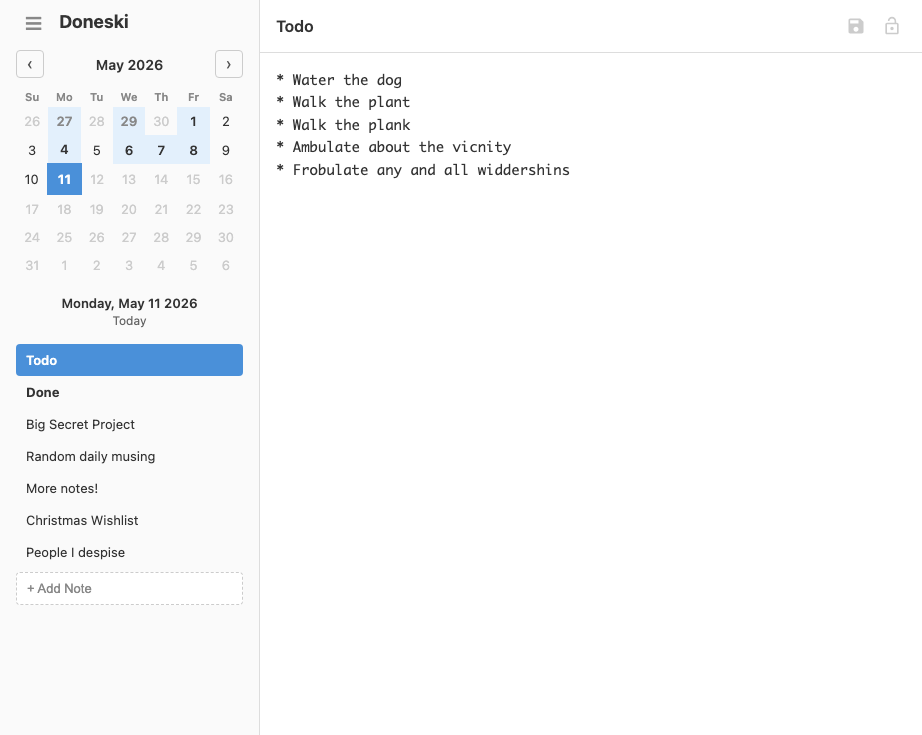
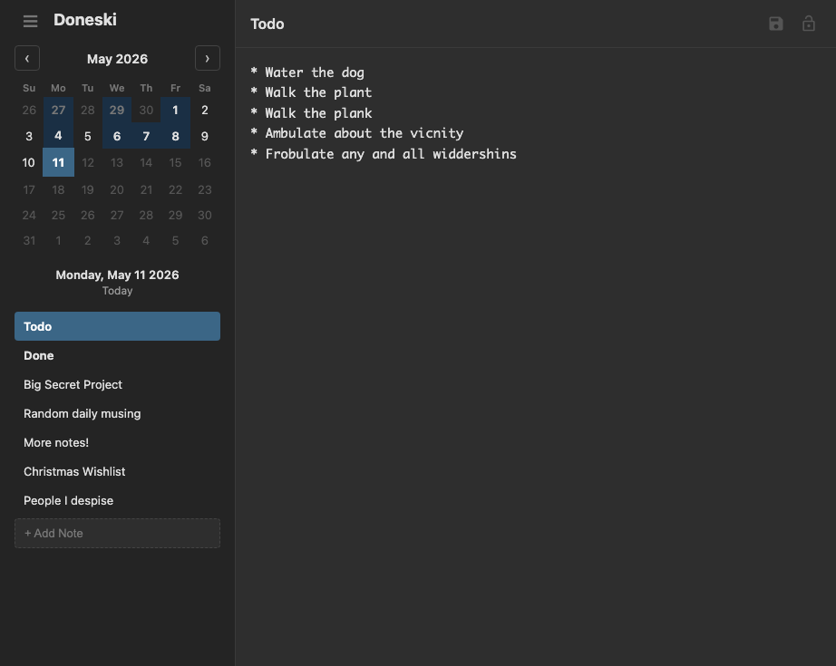

# Doneski

Doneski is a personal daily task and notes management web application designed for anyone who needs to track work items and meeting notes from day to day. Each day carries over the previous day's notes (except completed items), allowing you to maintain a running view of your tasks while keeping a clean daily record of what got done. It features a calendar-based navigation sidebar, per-note editing with auto-save, note locking to prevent accidental edits to past days, and a weekly report generator that compiles your completed items for easy sharing.

See `docs/architecture.md` for detailed information on how the app was designed and built.




# Running

Requires [uv](https://github.com/astral-sh/uv) and Python 3.13+.

```bash
uv sync
uv run doneski
```

The app will be available at `http://127.0.0.1:5000`. Note files are stored in Flask's instance folder (`instance/` relative to the project root by default). Override the location by setting `DONESKI_DATA`. Optionally set `DONESKI_HOST`, `DONESKI_PORT`, or `DONESKI_DEBUG`.

# Development

Run:

```bash
uv sync --group dev
```

Create a `.env` file containing the following:

```bash
DONESKI_DEBUG=true
WERKZEUG_DEBUG_PIN=off
DONESKI_DATA=/path/to/data
```

Then run the development server:

```bash
uv run doneski
```


Run tests with:

```bash
uv run pytest
```
